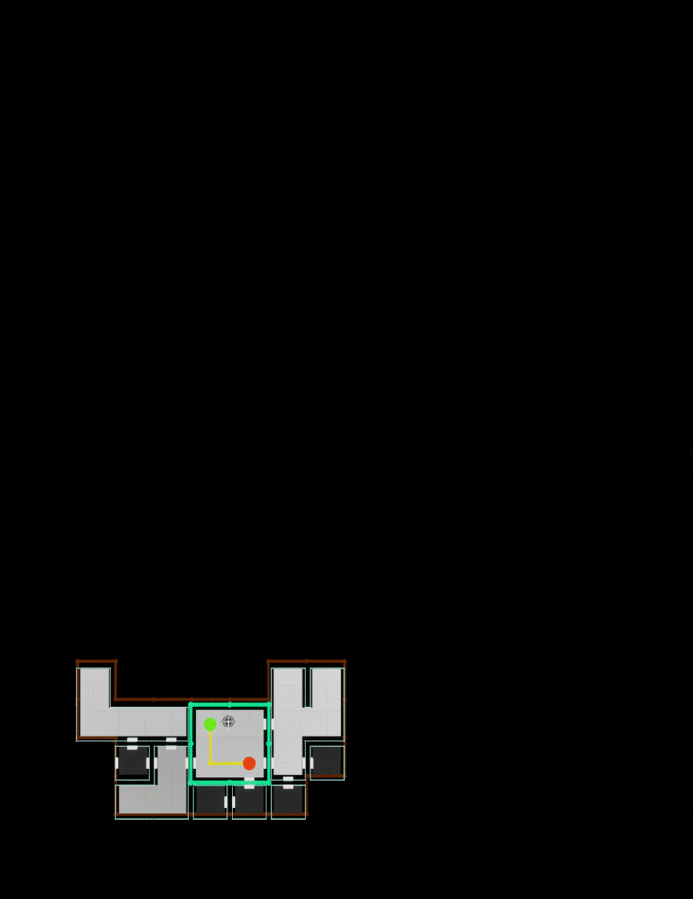

# v0.66

## New Nodes

### [Sample Inside Paths](/broken/pages/vYOeliotKnQinDuQTjRE)

MVP of this release, Sample Inside Paths lets you use sample from the data that lies inside paths. Applications are legion, but the most fun is probably being able to select & sort contours along a path — or simply quick'n dirty filter out paths that contains none of the targets.

<figure><figcaption></figcaption></figure>

<figure><figcaption></figcaption></figure>

> Because of the nature of the sampling, this one works best when writing to the @Data domain. Per-point attributes will be reset & use the default value instead.

### [Sort Collections](/broken/pages/6Htzi4q0jVIW9m2j3WdU)

A simple yet handy node that let your sort data collections based on @Data domain attributes. It leverages [PCGEx Sorting Rules](/broken/pages/tcxG6WrSupvpJ81xaz8T).

<figure><figcaption>
Nice thing is, since it's @Data domain, it'll work with any data!
</figcaption></figure>

### [Picker : Ranges from Set](/broken/pages/h4seh36s8hjQLFmkKfkz)

A new picker subnode that reads FVector2 as ranges of indices, works with any picker input.

<figure><figcaption></figcaption></figure>

### Cookie Cut _<mark style="color:yellow;">Subgraph</mark>_

A new util subgraph, a barebone "Cookie cutter" node. Serves both as an util, and a useful example to get an idea on how to do these stuff

<figure><figcaption></figcaption></figure>

<figure><figcaption></figcaption></figure>

<figure><figcaption></figcaption></figure>

### Remap Data _<mark style="color:yellow;">Subgraph</mark>_

A shorthand node to remap the value of a @Data attribute against all other datas. Will convert the result to a double.

<figure><figcaption></figcaption></figure>

### [Write Index](/broken/pages/FHOHoihpZNLQtEbyp0Qw) _<mark style="color:green;">Update</mark>_

Technically not a new node, but a hard-to-discover update so here's a shout-out.

**Disabling writing individual point index on Write Index will now enable it to work with any data type!** Very handy to write collection indices and entries num into a @Data attribute. Doesn't look like much, but it is still useful to uniquely identify paths and splines and stuff.

<figure><figcaption></figcaption></figure>

## Refinements

### [Remove Leaves](/broken/pages/WjZoClvwvC6Pu0MMybmx)

While it was already easy to use [Simplify Cluster](/broken/pages/v2YPks8szBwfitvHY05S) to remove leaves, it always bugged me there was no faster alternative — _Simplify Cluster computes an internal, path-only representation of the cluster to support all the parameters and feature it exposes_ — here it is! You can now use Remove Leaves with the [Refine Cluster](/broken/pages/6iW9pYp1d3LOq36O2EUU) node.&#x20;

<figure><figcaption></figcaption></figure>

## Filters

### [Angle Filter](/broken/pages/ZhhxKBGOPR4ebAVCVXGF)

The angle filter is a simple yet handy filter that does a comparison against the "angle" of a point. You can test against **Curvature** (Prev -> Current x Current -> Next) or **Spread** (Current -> Prev x Current -> Next). It will work with any dataset, it just that it's only meaningful if that data is ordered ^^

<figure><figcaption></figcaption></figure>

### [Segment Length](/broken/pages/h4ufabEpHOBHiazKyMwW)

The segment length filter really is a "distance against another point in the same dataset" filter. It can test against an offset from the currently evaluated point (i dist to i+N) or a specific index (i dist to N). It's obviously useful when dealing with paths, but will work all the same with any points — same as the other [Self comparison](/broken/pages/cGNlf1VqFsAFSF7lqIyG) filters.

<figure><figcaption></figcaption></figure>

## Tweaks

* The [Path Shift](/broken/pages/bePH1ZUtjsXNlevcTNAP) node now has an additional shifting type, `Cherry Pick`, that lets you, well, _cherry pick_ exactly what properties and/or attributes you want to shift.
* The [Within Range](/broken/pages/jNGg77jIqkphJtYfFBTw) filter now support external attribute set to read multiple ranges to test against.&#x20;
*   [Spline Mesh ](/broken/pages/ZS9nQlgX6BfSz6GkhjLz)& [Spline Mesh (Simple)](/broken/pages/E2CtOe0Knu5d6wVQeJuD) now read the the spline axis alignment from the static mesh descriptor, defaulting to the node' descriptor. There's a clean deprecation path so you shouldn't see any difference, but if you do, you change it from now on : 

    <figure><figcaption></figcaption></figure>

    That value can be set per-entry in the [Mesh Collection](/broken/pages/gwIxcj3QltkQMnBq3Ejw), under the **SM Descriptor** settings!
* [Path Crossings](/broken/pages/vop1JJlvf1mKTqZG4Ey1) now has the option to **not** create crossing points, so you can simply use it as a mean to tag paths.
* All samplers now have a `IgnoreSelf` toggle under advanced settings that's true by default. This let you safely use the same source/target data and only sample siblings.
*   Uber Filter & Uber Filter (Collection) now support direct picker inputs to only execute filters on specific indices. You can choose what happens for unpicked points (either pass or fail)\
    &#xNAN;_&#x54;hanks @3neo!_ 

    <figure><figcaption>
Particularly handy for path, to test only start &#x26; end points.
</figcaption></figure>

*   Optional pins now take a step back — you can revert to the old behavior in the plugin settings; but I feel it's a welcome de-noising that does a good job at showing which inputs are actually important vs advanced tweaks\
     

    <figure><figcaption></figcaption></figure>

## Bugfixes

* [Goal Picker random](/broken/pages/HFLfxHzE002nuvERrFzM) was busted, it's fixed now. It would only ever pick a single not-quite-random goal.
* Patched a huge hole with [group filters](/broken/pages/cusSazKL6lXo7PmxBMio) that would call unimplemented methods causing a crash when dealing with unexpected filter types — the group (and/or) node would allow unsupported filters to make it through. No longer!
* Fixed a bug with [Reduce Data](/broken/pages/ri7yKzETw95jdsg4g0Ak) where it would output the wrong min/max
* Fixed a bug with Split Path in Remove mode that would reconnect to closed loop' first point even if it was removed but the point-before-last was still valid.
