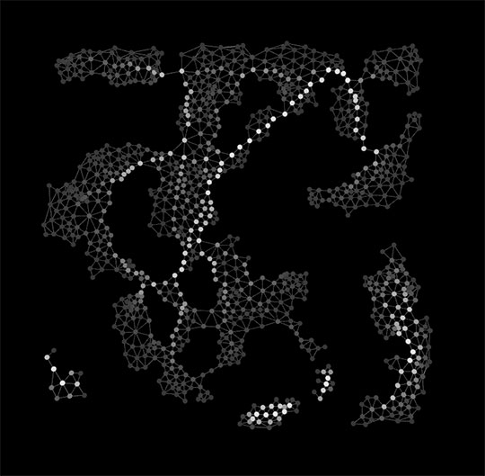
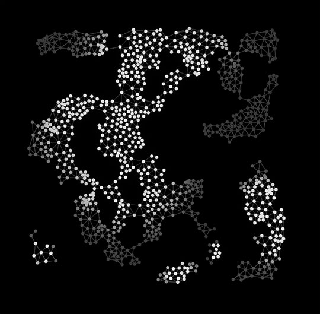
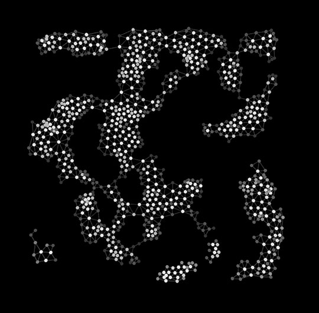
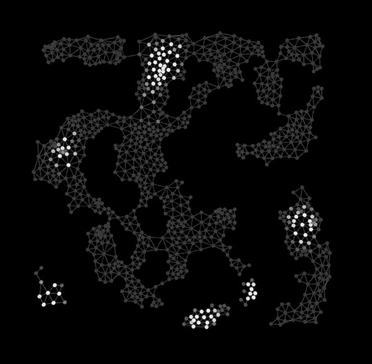
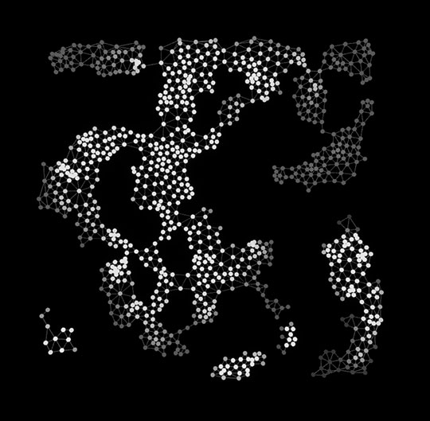
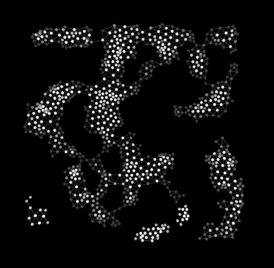

# v0.74.4

> This changelog contains changes from 0.74 to 0.74.4 — I did not broadcast the intermediary patches because those were mostly fixes & stability updates across the board. If you're into details I would recommend diving straight into the [v0.74 -> v0.74.4](https://github.com/Nebukam/PCGExtendedToolkit/compare/v0.74...v0.74.4) comparison on git !

## Documentation Update!

I've been really hard at work on the documentation these past few weeks; Parts of it are still AI-generated but everything should be significantly more accurate than it used to, and I proofread most of it. (_some quirks and notes in properties, but the most important bits are there_).

It's still lacking much needed screenshots but you can check the [Broken link](/broken/pages/qO1cb8vzXq15uzyVY7Bj "mention") section, it has a lot of _actually useful_ content and information; and **so does every single individual node from the** [Broken link](/broken/pages/lTRRQvfAi2miuD5Z28iX "mention")**.**

> It's still a work-in-progress of course, but I now have a _system_ to keep the doc in sync with the codebase, and make sure the doc link in the PCG Graph Editor are up-to-date <3

## ZoneGraph is v1.0 !

In other news, the [ZoneGraph interop](https://pcgex.gitbook.io/pcgex/zone-graph) is officially v1.0 — works at runtime, and allows for override on any single zonegraph property available so you have full control directly from inside PCG; plus simple  helpers (_"smart" polygon radiuses based on connected lanes' width_), optional polygon/spline outputs, the whole package.

<figure><figcaption></figcaption></figure>

## New Nodes

It wouldn't be a proper update without some new nodes and tweaks! Nothing scandalous this time, mostly ironing out the toolset.

### [bin-packing-3d-q4realbpp.md](../../../node-library/transform/modify/bin-packing-3d-q4realbpp.md "mention")

PCGEx older users will remember my early failures to adapt this [bin packing](https://www.nature.com/articles/s41598-023-39013-9) paper that's absolute _obscene_ feature-wise. Well, it's there now, in all its bin packing glory.

<figure><figcaption></figcaption></figure>

### [tuple-distribute.md](../../../node-library/metadata/keys/tuple-distribute.md "mention")

This is mostly useful for quick debug; it's basically the same as [tuple.md](../../../node-library/metadata/keys/tuple.md "mention") but each row as a weight so you can distribute property values onto points directly. I was spending too much time setting up attributes & match-and-set for the simplest situations so I figured this could be useful to everyone.

<figure><figcaption></figcaption></figure>

### [staging-fitting.md](../../../node-library/staging/staging-fitting.md "mention")

A bit niche, but I isolated the fitting feature of the [staging-distribute.md](../../../node-library/staging/staging-distribute.md "mention") node so it can be used in a standalone way; either using a collection map or from mesh references directly (_slower, as meshes needs to be loaded for their bounds to be computed_)

<figure><figcaption></figcaption></figure>

### [uber-filter-cascade.md](../../../node-library/filters/uber-filter-cascade.md "mention")

Another niche node, allows you to trickle down points through multiple layers of filters.

<figure><figcaption></figcaption></figure>

### [path-insert.md](../../../node-library/paths/modify/path-insert.md "mention")

This one has been on the roadmap forever; lets you insert points on existing paths at the closest location on these paths. Can be exclusive or not, snap or not etc.

<figure><figcaption></figcaption></figure>

### [blendop-all.md](../../../node-library/metadata/blending/blendop-all.md "mention")

A bit of a hack, this node auto-generates blending operation for all attribute available on sources in contexts that support blend operations (primarily [sampling](../../../node-library/sampling/ "mention") nodes)

<figure><figcaption></figcaption></figure>

### [filter-raycast.md](../../../node-library/filters/point-filters/spatial/filter-raycast.md "mention")

The filter no one asked for but that I had a unexpected need for. Does what's in the title : raycasts from tested points, can fail or pass if there's a hit, or hit distance thresholds.


I extended the line/shape tracing utilities as a consequence of working on this filter : [sample-line-trace.md](../../../node-library/sampling/nearest/sample-line-trace.md "mention") now supports shapes (sphere, box) with optional attribute-driven overrides!


<figure><figcaption></figcaption></figure>

## Tweaks

* All **Clipper2** nodes now offer additional outputs to identify points that are intersections, as well as the start/end of bevel endpoints (mostly useful for [clipper2-offset.md](../../../node-library/paths/generate/clipper2-offset.md "mention"))
* Extended support for **Data Stealing** to more nodes

### [cluster-centrality.md](../../../node-library/clusters/analyze/cluster-centrality.md "mention")

Got some new moves :&#x20;

<figure><figcaption>
Betweenness
</figcaption></figure> <figure><figcaption>
Closeness
</figcaption></figure> <figure><figcaption>
Katz
</figcaption></figure> <figure><figcaption>
Eigenvector
</figcaption></figure> <figure><figcaption>
Harmonic Closeness
</figcaption></figure> <figure><figcaption>
Degree
</figcaption></figure>

#### Most notable bugfixes:

* Fixed a major task execution problem that would cause small tasks to complete too fast, causing a boatload of silent fails, crashes, and general instability.&#x20;
* Clipper2 Now properly preserve (or interpolates) Z coordinates at intersections and bevels. ([bug](https://github.com/AngusJohnson/Clipper2/issues/1065))

<figure><figcaption></figcaption></figure>

* Fixed a sneaky determinism issue with pathfinding when generating multiple paths in multiple disconnected clusters
* Fixed a bug in [path-split.md](../../../node-library/paths/generate/path-split.md "mention") when split condition existed but produced no valid split (_split over the first or last point of an open path would omit the entire path from the output_)
* Fixed a bug with asset collections when using 0-weight entries (_which is the quick way to "disable" an entry_) that was causing cache shifting and indexation mismatch.
* Fixed busted union data on cluster fusing nodes
* Internal refactors & cleanup:
  * Property system
  * Union processing stack (lots of small bugs, dead code etc)
