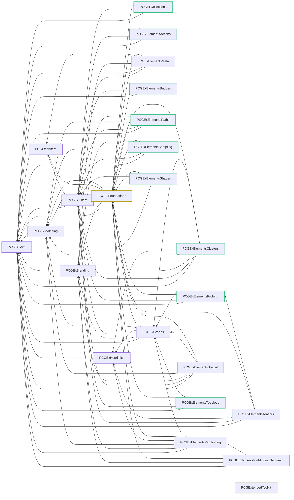

# v0.73


**At the time of writing, these changes are in their respective `-module-breakdown` branches, and not on main yet.**


## Module Breakdown Update

**This is a huge one for people building from source;** _folks using the precompiled binaries can stop reading there : there's no new major user-facing feature :)_


Skip to [#migration](v0.73.md#migration "mention") if you just want the critical infos


> Historically, PCGEx has always been a plugin with a single internal module : PCGExtendedToolkit and its editor companion.
>
> As some of you know compile times for the plugin have been a pet peeve of mine, and i've been focusing on alleviating that over the past month. From type erasure to include cleanups, the last remaining step (and also the most painful one) was breaking down the monolith into smaller modules.
>
> The only downside I've seen is an explosion in size of debug symbols (.pdb), but the full plugin is still \~30mb of dlls.

#### What's in it for you?

* Greatly improved compilation times.
* Much smaller, more granular dependencies when extending the codebase.
* More granular control over the compiled feature set. _(See_ [_cherry picking_](v0.73.md#feature-set-cherry-picking)_)_

***

## Migration

Because the way unreal works and references classes by module+name, this update technically breaks _everything_. <mark style="color:$warning;">Currently, each module inject redirects at runtime</mark> from `PCGExtendedToolkit.XXX` to `PCGExSubModuleName.XXX` . Needless to say that's quickly a lot of useless redirects (_\~480_)

Once you're done with the migration, go to `Source/PCGExCore/PCGExCore.Build.cs` and change this line:

```
PublicDefinitions.Add("PCGEX_SUBMODULE_CORE_REDIRECT_ENABLED=1");
```

to this

```
PublicDefinitions.Add("PCGEX_SUBMODULE_CORE_REDIRECT_ENABLED=0");
```

And you'll need to recompile the plugin.

#### Custom code

For those who rely on the API, you might need to revisit some includes but struct/class name haven't changed so it shouldn't been too much of a hassle.

Most likely you'll need to declare dependencies on `PCGExCore` & `PCGExFoundations` which are the two core libs. If you rely on...

* Filters : `PCGExFilters`
* Data/Target Matching : `PCGExMatching`
* Heuristics : `PCGExHeuristics`
* Building Graph / Cluster nodes : `PCGExGraphs`&#x20;
  * _If you only consume clusters, `FCluster` is part of `PCGExCore`._
* Existing Cluster nodes (i.e `BuildCustomGraph`) : `PCGExElementsClusters`

***

### Feature Set Cherry Picking

Unreal didn't made it easy, <mark style="color:$success;">**but it's now possible to cherry pick the feature set to compile the plugin with.**</mark> It will automatically pull boilerplate dependencies and generate a clean .uplugin that's tailored to your project.



### Edit `Config/SubModulesConfig.ini`

Comment out the sub-modules you don't care about.&#x20;

The legacy, complete feature set is enabled by default; but if you want to shave some compile time and reduce dependencies on external plugins you don't care about you can strip `PCGExElementsPathfindingNavmesh` _(pulls the nav system),_ `PCGExElementsTopology` _(pulls `GeometryScript` and `PCGGeometryScriptInterop`),_ `PCGExElementsTensors` (_which I know very few people are using_)



### Regenerate the .uplugin

Go to Scripts/ and run the .bat if you're on windows, or .sh if you're on macos/linux; this will regenerate a .uplugin with the right declarations.



### Recompile

Remove binaries & intermediates and enjoy!



***

### Modules Dependency Graph

This is what the dependencies look like:

* A couple for core modules that each isolate a set of low level features/ecosystems (`Blending`, `Filters`, `Graphs`, etc)
* Feature-centric modules which contains actual nodes
* Foundations comes with a few basic nodes

> I know this looks completely overkill, but it's actually much better for compile times and maintenance to split things that way.


