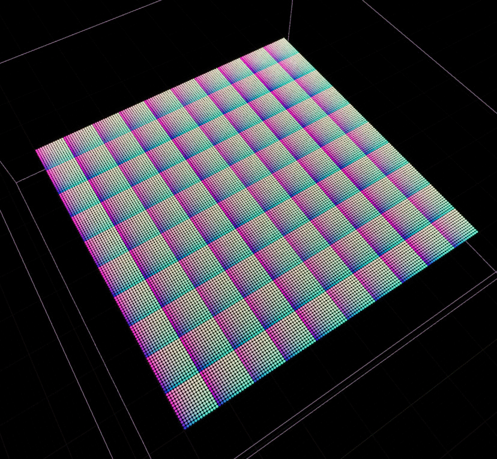
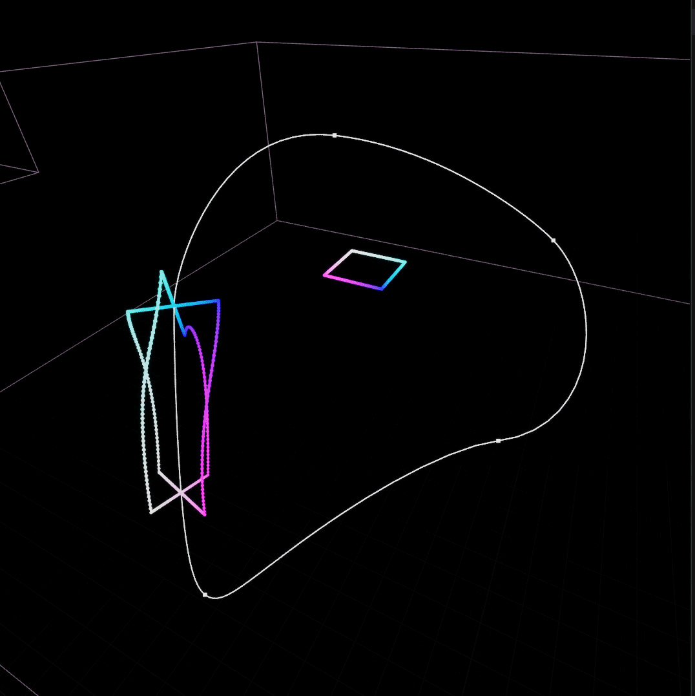
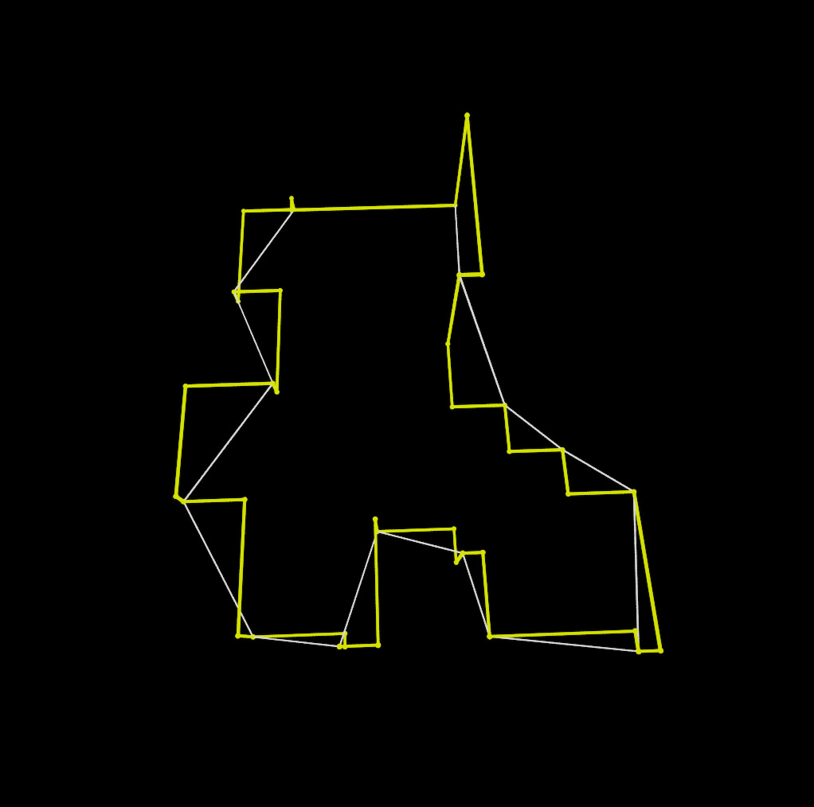
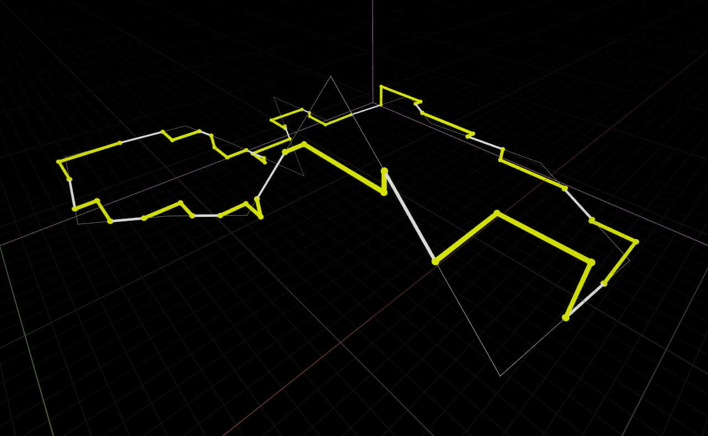

# v0.67


This release introduces a new plugin dependency : **PCG Geometry Script Interop**.



This release has breaking changes for **Copy to Points** & **Copy Cluster to Points**, see [Data Matching](v0.67.md#data-matching)


## New Nodes

### [Path : Stitch](../../node-library/paths/stitch.md)

A handy path util that can "connect" path into longer ones based on spatial proximity. It does a lot more than it seems, as some path data needs to be reverted to create a coherent, longer one; also handle closed loops.


This one is a bit rough around the edges at the moment


<figure><figcaption>
Disconnected path below, those same path, stitched, above.
</figcaption></figure>

### [Normalize](../../node-library/transform/normalize.md)

Nothing fancy, a node that can output the point position normalized against the data bounds in world space — very handy for UV sampling and _other things_.

<figure><figcaption>
Normalize output to $Color
</figcaption></figure>

### [Copy to Paths](../../node-library/transform/copy-to-path.md)

A **work in progress** node to copy & deform point data along paths/splines. It has limited use at the moment, but it might still be useful to someone in its current state!

<figure><figcaption></figcaption></figure> <figure><figcaption></figcaption></figure> <figure><figcaption></figcaption></figure>

### Concave Hull 2D _<mark style="color:yellow;">Subgraph</mark>_

A simple helper subgraph to find an approximative concave hulls of points. It's a pimped version of what used to be the "Blob contours" example

<figure><figcaption></figcaption></figure>

> It's really doing a simple Delaunay triangulation, removes outlier edges within a tolerance and find the hull and optionally applies smoothing. It's a subgraph, so you can look inside!

## Path to Surface

I was getting tired of the `path to cluster -> cluster surface` workflow just to get surface paths, so here goes a more efficient and straightforward node to do just that:

<figure><figcaption></figcaption></figure>

## Major tweaks

### Data Matching

Previously, only two nodes had a concept of "data matching" — **pairing one or more target data to input data** ([Copy to Points](../../node-library/misc/copy-to-points.md) & [Copy Clusters to Points](../../node-library/clusters/copy-clusters-to-points.md)). This concept is now making it to more nodes, in a streamlined fashion, not unlike filters.

New inputs & settings are available on nodes that support it (the two aforementioned nodes + data samplers that support multiple targets) : **Match Rules**.

You can read more about it here :&#x20;


[data-matching](../../node-library/misc/data-matching/)


<figure><figcaption></figcaption></figure>


This makes existing nodes even more versatile that then used to be, with the ability to output unmatched inputs to a separate pins and reduce the number of copies/chaining/loops necessary to achieve a complex operations.


### Subdivision : Manhattan _<mark style="color:green;">New mode</mark>_

Any node that had subdivision capabilities ([Subdivide](../../node-library/paths/subdivide.md), [Bevel](../../node-library/paths/bevel.md)) now has an additional more complex mode : Manhattan.

<figure><figcaption></figcaption></figure> <figure><figcaption>
Manhattan bevel, anyone?
</figcaption></figure>

> This is on top of the Distance & Count mode, and will most likely carry over whenever there's an opportunity for subdivision features. _I was initially thinking of making this its own node for easier discovery, but so much of the needed code was already handled where I need general subdivision so..._

### Projection : Best Fit _<mark style="color:green;">New mode</mark>_

Any node that offer projection capabilities to do its bidding now has access to a new projection mode : Best Fit, **which computes the best fitting plane and uses its normal as a projection.**&#x20;

<figure><figcaption></figcaption></figure>


This might look underwhelming but it's actually a pretty major improvement when it comes to clusters & contours : **best fit is computed per cluster.** Projection is used by a tons of nodes, but especially contouring ones.&#x20;


<figure><figcaption>
Cluster Hull with Normal projection (Default, Up)
</figcaption></figure> <figure><figcaption>
Cluster Hull with Best Fit projection
</figcaption></figure>

> This is available in all contours nodes, hulls, path winding, delaunay etc — anywhere "projection settings" is available. It's not the new default as to not override previous settings, and also this operation is not free on large set of points.

### Cluster Surface

* Cluster Surface now output PCG Dynamic Mesh by default (_Legacy mode is still available for existing setups_)
* Cluster Surface now have proper normals right off the bad (both legacy and PCG)

<figure><figcaption></figcaption></figure>


The native DynamicMeshSpawner doesn't handle collision, so if you stop using legacy you will need to enable collision manually (using GoemetryScript & enabling complex collision on the spawned component).


### Path + Tangents

Previously, nodes that used paths and expected tangents exposed a simple toggle to apply custom tangents based on attributes; which would, most of the time, force the use of a [Write Tangents](../../node-library/paths/write-tangents/) node right before.

This behavior has changed, and while you can still use attributes, **the modules that used to be only exposed in Write Tangents are now available "in place"**. It's slightly more expensive but doesn't duplicate the data — and scaling is supported there too!

<figure><figcaption></figcaption></figure>

### Connect Cluster - Additional outputs

[Connect Cluster](../../node-library/clusters/connect-clusters.md) now has  two optional outputs :&#x20;

* Vtx Connector Flag : increment an `int32` each time a bridge connects to it.
* Edge Connector Flag : set a `bool` on a edge if it's a newly created bridge.

<figure><figcaption></figcaption></figure>

### Mesh to Clusters

Mesh to cluster now has a new output mode, Boundaries, that output only edge loops with no adjacent triangles. This is especially handy if you have mesh with "open ends" or no backfaces.

_Stole the idea from @Syscrusher!_

<figure><figcaption></figcaption></figure>

> This comes with a refactor of the mesh processing, which should be x5-x10 as efficient as it used to.

### Delaunator for Delaunay Triangulation

Up until now I was relying on Epic geometry library to generate 2D delaunay — but Epic geometry library is notably slow, and doing trivial things like the [concave hull 2D](v0.67.md#concave-hull-2d-subgraph) subgraph, it shows.

I evaluated a few alternative and found [Delaunator-cpp](https://app.gitbook.com/u/J8KNpQJUmWRCAc0RuEB3U737mYD2) which is incredibly faster than Epic code, so this is now a new third party dependecy in the codebase. It exclusively support 2D triangulation but it's the most used one; and it also benefit Voronoi 2D straight up :)

<figure><figcaption>
~200k point triangulation!
</figcaption></figure>


This translates as a massive improvement for Delaunay & Voronoi lovers; especially on large graphs.


## Filters

No new filters.

## Tweaks

* Compare Nearest filter now support multiple source targets
* Convex Hull 2D now has the (disabled by default) option to not output mirror cluster. Couldn't enable it for legacy reason but it saves tons of memory when you only need the paths and have lots of them.
* Migrated some of my own broadcasting code to native PCG accessor, which should translate as a negligible-to-significant speed-up in a variety of situations (primarily used in attribute-driven settings, filters etc.)
* String compare can now swap operands to enable broader use of contains/start with/end with checks
* Inclusion filters have been revisited and now expose full control over the projection of the paths (Best Fit, etc) — default remain as it was under the hood (simple planar projection using the up vector)
* Filters that rely on data (Distance, Bounds, etc.) can now output a constant (true or false) instead of an error when there is no valid input. The default for this has been set to _false_.\
  &#xNAN;_&#x54;hanks to @Buunuu for forcing me to handle that usecase I've never considered :p_

## Bugfixes

A bunch of them.
