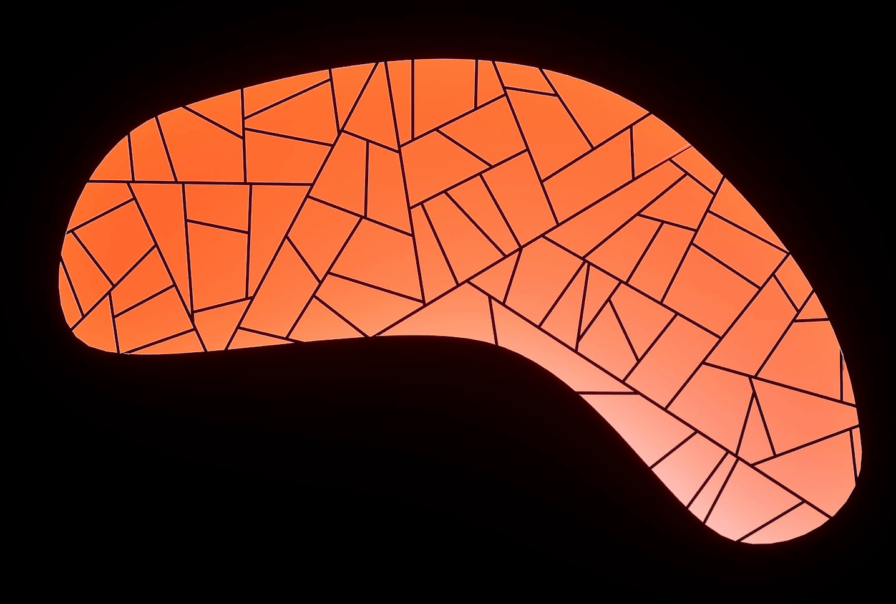

# v0.71


NOTE : This changelog includes patch changes as well (`0.71.1`, `0.71.2` etc)


## Icons, icons _(almost)_ everywhere

A lot of enums have been turned into an inline list of icons — I've always found dropdowns to be in the way of iteration, and lots of features are hidden behind dropdowns.&#x20;

<figure><figcaption></figcaption></figure> <figure><figcaption></figcaption></figure> <figure><figcaption></figcaption></figure>

> Many nodes are notoriously complex, often requiring trial and error to get the right result. That process is now dramatically simpler!

Inlined enums

`EPCGExInputValueType` / `EPCGExInputValueToggle`

Constant / Attribute / _Disabled (contextual)_

<figure><figcaption></figcaption></figure>

***

`EPCGExOptionState`

Used mostly in generic node settings, for things that have an global default value in the plugin settings but can be overridden per-node.

Default / Enabled / Disabled

<figure><figcaption></figcaption></figure>

***

`EPCGExFilterFallback` / `EPCGExFilterNoDataFallback`

Throw error / Pass / Fail

<figure><figcaption></figcaption></figure>

***

`EPCGExPointBoundsSource`

Scaled Bounds / Density Bounds / Bounds / Center

<figure><figcaption></figcaption></figure>

***

`EPCGExDistance`

Center / Spherical Bounds / Scaled Bounds

<figure><figcaption></figcaption></figure>

***

`EPCGExClusterElement`

<figure><figcaption></figcaption></figure>

***

`EPCGExAttributeFilter`

<figure><figcaption></figcaption></figure>

***

`EPCGExComparisonDataType`

<figure><figcaption></figcaption></figure>

***

`EPCGExScaleToFit`

<figure><figcaption></figcaption></figure>

***

`EPCGExJustifyFrom`

<figure><figcaption></figcaption></figure>

***

`EPCGExJustifyTo`

<figure><figcaption></figcaption></figure>

***

`EPCGExFitMode`

<figure><figcaption></figcaption></figure>

***

`EPCGExMinimalAxis`

<figure><figcaption></figcaption></figure>

***

`EPCGExMaterialVariantsMode`

<figure><figcaption></figcaption></figure>

***

`EPCGExEntryVariationMode` / `EPCGExGlobalVariationRule`

<figure><figcaption></figcaption></figure>

***

`EPCGExWinding` / `EPCGExWindingMutation`

<figure><figcaption></figcaption></figure>

***

`EPCGExSortDirection`

<figure><figcaption></figcaption></figure>

## Asset Editor Revamp

Put a lot of work (probably more than it shows) into building a custom editor for the asset collections, so they can be used much more efficiently than they used to!

<figure><figcaption></figcaption></figure> <figure><figcaption></figcaption></figure>

* Collection-level settings have been moved to their own tab so you can focus on either the assets or the collection itself.
* Entry mesh (or sub collection), as well as weight and category are now hoisted directly into the array item, so no more expending to get an overview on the content of the collection
* The same courtesy have been applied to material overrides
* Variations have now have a very condensed format
* There are visibility filters at the bottom
* Actions & tool buttons are now always visible in a condensed format at the top

## New Nodes

### [Transform Points](v0.71.md#transform-points)

<figure><figcaption></figcaption></figure>

Not dissimilar to the stock' Transform Points node, the PCGEx version has a few addition tricks down its sleeves.

* **Every single property can be either a constant or read from a point attribute/property**
* Each component support two snapping modes: before offset and after offset.
  * Before Offset applies snapping on the random offset that's added on the existing value
  * After Offset applies the offset and then snap the result.
* Each component has an additional Scaling property exposed to apply a scale to the random range for that component.


After Offset Snapping means **you can use this node without randomization**, <mark style="color:$success;">**for snapping alone**</mark>.


<figure><figcaption>
The same snapping options can be found in the "Variations" settings of the asset collections
</figcaption></figure>

### [Collection to Module Infos](../../node-library/assets-management/collection-to-module-infos.md)

Added rudimentary support for grammar module settings directly as part of the asset collection, with a nice little node to **output module infos from PCGEx' collections**. _It support subcollection expansion and few other neat tricks to make your life easier._

<figure><figcaption></figcaption></figure>

> More of that will come, I have a "Grammar Staging" node down the pipe that will work exactly like [asset-staging](../../working-with-pcgex/asset-staging/ "mention")but specifically for points coming out of the grammar workflow.

### [Write States](../../node-library/filters/write-states/)

the [write-states](../../node-library/filters/write-states/ "mention")node is the point-friendly version of what used to be called "Flag nodes". It takes [state-point.md](../../node-library/filters/write-states/state-point.md "mention")subnodes to do bitwise operation on an `int64` attribute.


`Flag Nodes` has been renamed [flag-nodes](../../node-library/clusters/metadata/flag-nodes/ "mention") and `Node Flag`  [node-flag.md](../../node-library/clusters/metadata/flag-nodes/node-flag.md "mention").\
&#xNAN;_`Cluster : Write States` supports_ [state-point.md](../../node-library/filters/write-states/state-point.md "mention") _nodes, there's not much difference between the two!_


<figure><figcaption></figcaption></figure>

### Parcels 2D <mark style="color:$warning;">Subgraph<mark style="color:$warning;">

Made a decent re-usable subgraph out of the example for the subdivision part alone. It's an optimized alternative, although it's still a recursive loop; it has some fail safes to stop iterating for no good reason, and more interestingly, exposes filters so you can control stop split conditions "manually". _At worst, it's a good example itself on how to use the break recursion node!_

<figure><figcaption></figcaption></figure>

<figure><figcaption></figcaption></figure>

## Bitmask Collections

A new type of data asset to create re-usable bitmasks across a project.&#x20;

<figure><figcaption></figcaption></figure>


PCGEx now comes with the **3D Compass**, a default bitmask collection with 24 spatial directions.


<figure><figcaption>
Bitmasks can now reference external assets to pick &#x26; compose more complex values 
</figcaption></figure>

Note that inside a bitmask collection, these entries come with a direction. This is to pave the way for WFC experimentations and streamline cluster state workflows — it's entirely optional.

## New Filters

Data Bounds Aspect

<figure><figcaption></figcaption></figure>

A simple collection-level filter that lets you do a numeric comparison against a variety of bounds aspects, from the usual `Extents`, `Min/Max`, `Size`, but also `Volume` and `Ratio`!

> I added that as I needed it for the parcel subgraph to ensure cells that were too small wouldn't be subdivided down problematic metrics. I might add a per-point version at some point for the aspect ratio.

## Tweaks

### [Path : Solidify](../../node-library/paths/solidify.md) <mark style="color:$danger;">Refactor<mark style="color:$danger;">

<figure><figcaption></figcaption></figure>

The solidify node got a much needed refactor, exposing better controls over the "solidification" process. This is mostly to make it more friendly to use directly with [asset-staging](../../node-library/assets-management/asset-staging/ "mention").

It's doing the same thing as before, but now there are more control exposed:

* Axis order is exposed
  * First axis is the one that will be aligned toward the next point
  * Second axis is the normal
  * Third is the cross axis, but the final transform is kept orthonormal
* Rotation component
  * Rotation components have been exposed so you can pick how the rotation is built

And finally, no matter what the above looks like, bounds are consistently calculated to match a "segment" aspect. Before that it was very left to chance.

### Remap Snapping

<figure><figcaption></figcaption></figure>

### Bitmask UI

As part of the UI effort I did a quick pass on the bitmask interface to make it less obscure (and educational almost!) to work with bitmasks.

<figure><figcaption></figcaption></figure>

#### [Linetrace](../../node-library/sampling/line-trace.md) Vertex Color

Line trace node can now extract vertex color at the hit location.

<figure><figcaption></figcaption></figure>

#### Easier search

Added a few helpers/broken down some node to make discovery easier (specifically inclusion)

<figure><figcaption></figcaption></figure> <figure><figcaption></figcaption></figure>

