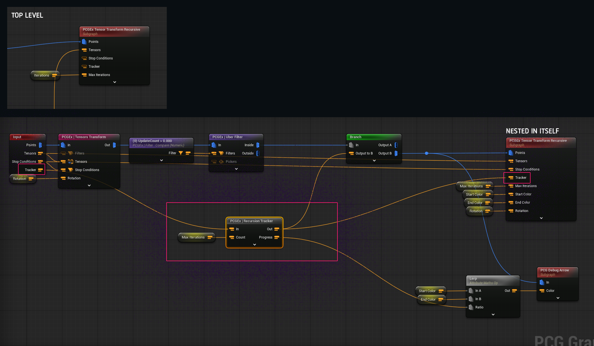

# Data Matching

### Inputs vs Targets

A handful of nodes have making use of "target" inputs, and will process each input against each targets. **Data matchings lets you cherry pick which target data is a "match" for each input using subnodes.**

<figure><figcaption>
Copy Cluster to Point with Match by Index (Tiling)
</figcaption></figure>

### How matching works

The goal of data matching is to let you choose which input can be paired with which target(s). There is no default limit to the number of targets that can be matched with a given input — by default (if matching is disabled), **all inputs will be working with every available target.**

Match rules lets you have control over that, and, for example, say:

* Input & target must share a tag.
* Input must have the `MyID:XXX` tag, and _XXX_ must be equal to the target `@Data.Pair` attribute value.
* Input are randomly matched with targets

#### Multiple target data vs Multiple target points

Different nodes have different ways to handle the concept of "targets" : Samplers for example do matching between multiple data vs target _data_; while nodes such as a Copy To Points & Copy Clusters To Points will do matching between multiple data and target _points_.


The only major difference is when dealing with target data, using @Data domain attributes is preferred : if you target a per-point attribute and the check operates against the data, **it will default to the value of the first element**.


