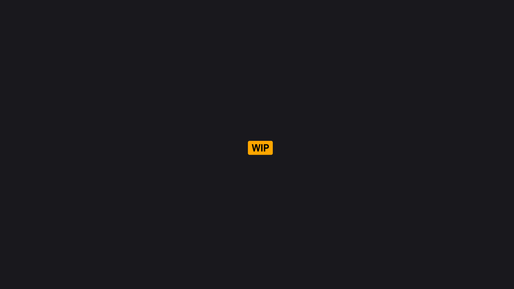

# Topology

**At some point, you want actual geometry — not just points.** Clusters and paths describe structure, but they're still abstract data. Topology operations turn that structure into renderable dynamic mesh surfaces.

<figure><figcaption>
Cluster with cells → generated mesh surface showing triangulated faces
</figcaption></figure>

### From Structure to Surface

Each topology node takes a different kind of input and triangulates it into mesh geometry:

| Node                     | Input                 | What It Does                                                                    |
| ------------------------ | --------------------- | ------------------------------------------------------------------------------- |
| **Cluster Surface**      | Cluster (Vtx + Edges) | Traces edges to find closed cells, triangulates each cell into polygon faces    |
| **Path Surface**         | Closed paths          | Treats each path as a closed polygon boundary and triangulates it               |
| **Point Surface**        | Scattered points      | Computes Delaunay triangulation directly — no edges needed                      |
| **Clipper2 Triangulate** | Closed paths          | Constrained Delaunay triangulation with fill rules and automatic hole detection |

**Cluster Surface** is the most involved. It walks the edge connectivity to identify closed cells, projects them to 2D, applies cell constraints, then triangulates. Cell constraints let you filter by shape (convex/concave), size (area, perimeter, point count), compactness, and whether to include the outer boundary cell.

**Clipper2 Triangulate** handles the case where you have overlapping or nested paths — fill rules (even-odd, non-zero, positive, negative) determine which regions are solid and which are holes.

### The Pipeline

All topology nodes follow the same general process:

1. **Project to 2D** for triangulation
2. **Apply constraints or fill rules** to filter geometry
3. **Triangulate** (Delaunay or constrained)
4. **Compute normals**, optionally weld edges
5. **Apply material and UVs**
6. **Output** as PCG Dynamic Mesh data

The output is dynamic mesh data — spawned into the world with **Spawn Dynamic Mesh**, which creates PCG-managed `DynamicMeshComponent` actors that clean up automatically when the graph regenerates.

### Mesh Settings

All topology nodes share configuration for the generated mesh:

* **Material** and default vertex color
* **UV channels** with multiple projection methods
* **Normal computation** with optional flip
* **Edge welding** for cleaner geometry
* **Coordinate space** selection

These are the same settings across all topology nodes, so switching between cluster-based and path-based generation doesn't mean reconfiguring the output.


Topology output is runtime geometry. It's base mesh data that's often a starting point for further refinement rather than a final result.


### Related

* Clusters - Source topology for mesh generation
* Paths - Source paths for surface generation
* Topology Nodes
